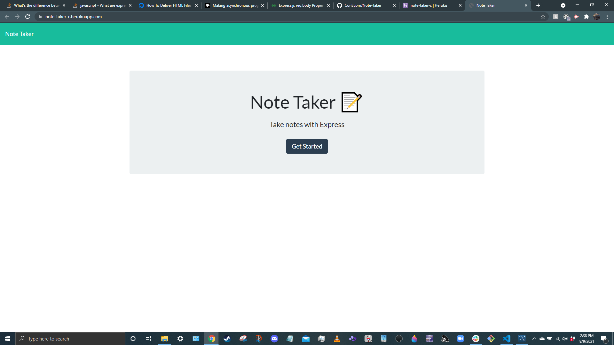
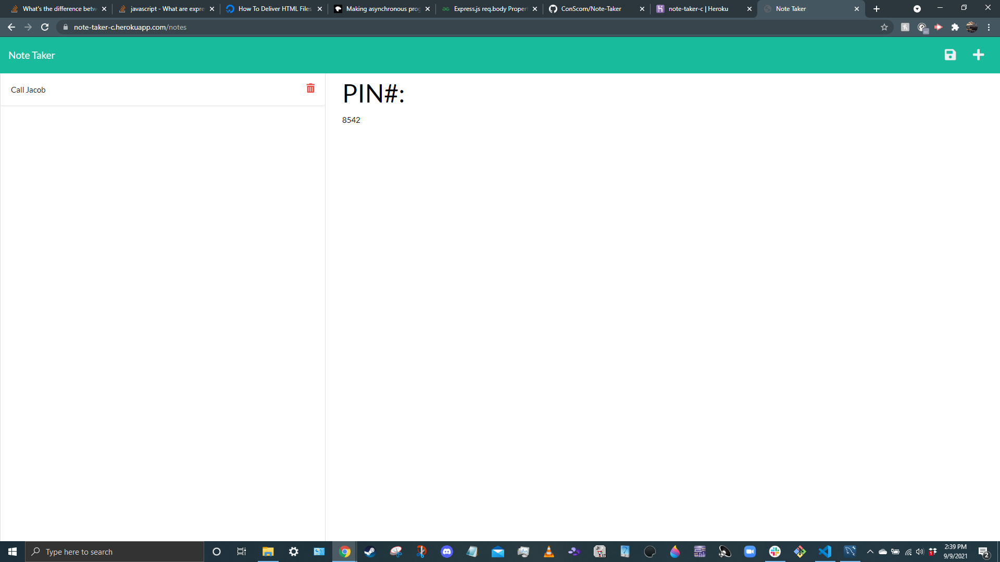

# Note-Taker
     
## Description

Note-Taker is an app that allows you to take notes, save them for later, and delete them at any time. It is my first full-stack application, and I built it to further my understanding of backend development.

## Table of Contents

- [Installation](#installation)
- [Usage](#usage)
- [License](#license)
- [Questions](#questions)

## Installation

Here is the link to the Github repository: (https://github.com/ConScorn/Note-Taker)
Here is the link to the deployed application: (https://note-taker-c.herokuapp.com/)

## Usage

Navigate to the deployed application through the link. Once there, click 'Get Started', and write in any notes you would like. Once you have typed a note, click on the 'save' icon in the top-right, in the navbar. If you would like to remove a past note, click on the delete icon for that note.

## License

MIT License

Copyright (c) [year] [fullname]

Permission is hereby granted, free of charge, to any person obtaining a copy
of this software and associated documentation files (the "Software"), to deal
in the Software without restriction, including without limitation the rights
to use, copy, modify, merge, publish, distribute, sublicense, and/or sell
copies of the Software, and to permit persons to whom the Software is
furnished to do so, subject to the following conditions:

The above copyright notice and this permission notice shall be included in all
copies or substantial portions of the Software.

THE SOFTWARE IS PROVIDED "AS IS", WITHOUT WARRANTY OF ANY KIND, EXPRESS OR
IMPLIED, INCLUDING BUT NOT LIMITED TO THE WARRANTIES OF MERCHANTABILITY,
FITNESS FOR A PARTICULAR PURPOSE AND NONINFRINGEMENT. IN NO EVENT SHALL THE
AUTHORS OR COPYRIGHT HOLDERS BE LIABLE FOR ANY CLAIM, DAMAGES OR OTHER
LIABILITY, WHETHER IN AN ACTION OF CONTRACT, TORT OR OTHERWISE, ARISING FROM,
OUT OF OR IN CONNECTION WITH THE SOFTWARE OR THE USE OR OTHER DEALINGS IN THE
SOFTWARE.

## Questions

Here is a link to my GitHub profile: https://github.com/ConScorn. Otherwise, you can email me at: connorscorn@hotmail.com
